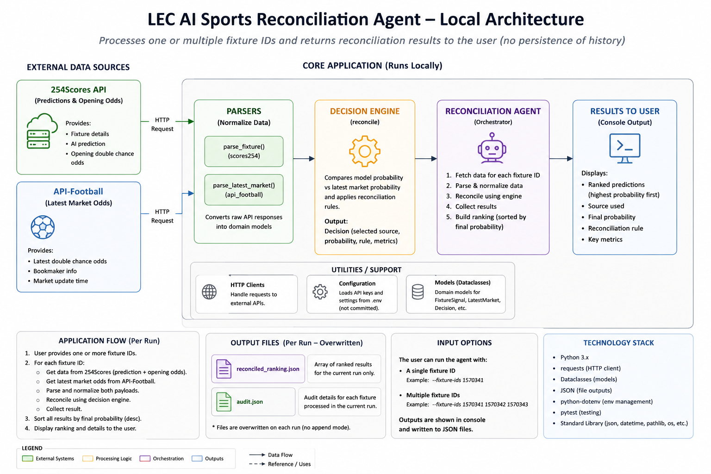

# LEC AI — Double Chance Prediction Reconciliation Agent

This project reconciles an earlier 254Scores AI **double-chance** prediction and opening price with the latest pre-match Double Chance price from API-Football.

## Architecture

The agent runs locally and processes one or multiple fixture IDs. For each fixture, it retrieves the existing AI prediction and opening double-chance odds from 254Scores, retrieves the latest double-chance odds from API-Football, normalizes the responses, applies the reconciliation rules, and presents the resulting predictions to the user.



## Authoritative data flow

1. The user supplies one or multiple fixture IDs.
2. The agent retrieves the existing fixture, AI prediction, league information, and opening double-chance odds from 254Scores.
3. The agent retrieves the latest pre-match double-chance odds from API-Football.
4. API responses are parsed into internal domain models.
5. Opening and latest decimal odds are converted into implied probabilities.
6. The decision engine compares the AI model probability with the latest market probability.
7. The reconciliation rule determines which signal should be used.
8. Successfully reconciled fixtures are ordered by final probability which is the Ranking/current confidence after reconciliation.
9. Results and audit information are shown to the user and written to JSON output files.

## APIs

254Scores authentication:

```text
Authorization: Bearer <SCORES254_API_KEY>
```

API-Football authentication(Please register to receive a free tier key and insert the same on the .env file before running project.):

```text
x-apisports-key: <API_FOOTBALL_KEY>
```

## Run
I have shared sample .env configurations to allow execution of the Agent on the email reply.

```bash
python3 -m venv .venv
source .venv/bin/activate
pip install -r requirements.txt
cp .env.example .env
pytest -q
python3 main.py --fixture 1570338
```

Batch:

```bash
python3 main.py --fixtures 1570338 1570339 1563093
```

## More that can be done with more time
With more time i could basically do below things to make the agent more valuable.
- Design a front allowing users to search for matches and get comparisons.
- Use a Database instead of json files to save states and also to properly track Odd changes
after 3 hours and persist the same on our database for easier and effiecient comparisons by the Desision engine.
- Intergrate AI e.g chatgpt API's to directly get analysis based on the changes and apply rules, instead of performing the calculations manually which creates room for errors.
- Intergrate the agent with telegram and deliver a Bot allowing users to compare Ai and market driven change insights.
